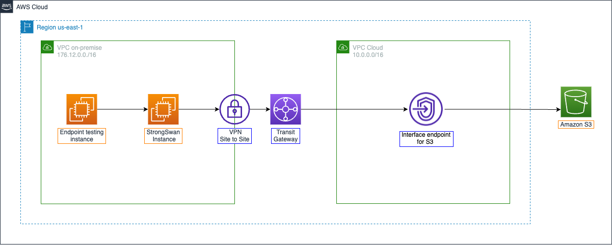

# Secure Hybrid Access to S3 using VPC Endpoints

A comprehensive AWS workshop demonstrating how to securely access Amazon S3 from both cloud and on-premises environments using VPC endpoints and AWS PrivateLink.

## 🎯 Workshop Overview

This hands-on workshop teaches you how to implement secure, private connectivity to Amazon S3 without exposing traffic to the public internet. You'll learn to configure and test two types of VPC endpoints:

- **Gateway VPC Endpoint** - For accessing S3 from cloud resources using private IP addresses
- **Interface VPC Endpoint** - For accessing S3 from on-premises locations via AWS PrivateLink

## 🏗️ Architecture

The workshop uses a dual-VPC architecture:

- **VPC Cloud** - Simulates cloud resources with Gateway endpoints and EC2 instances
- **VPC On-Premises** - Simulates on-premises environment with Site-to-Site VPN connectivity via AWS Transit Gateway



## 📚 Learning Objectives

By completing this workshop, you will:

- Understand AWS PrivateLink and VPC endpoint concepts
- Configure Gateway VPC endpoints for S3 access from cloud resources
- Set up Interface VPC endpoints for hybrid connectivity
- Implement VPC endpoint policies for enhanced security
- Test connectivity from both cloud and simulated on-premises environments
- Apply networking best practices for secure AWS service access

## 🛠️ Prerequisites

- AWS Account with appropriate permissions
- Basic understanding of AWS VPC, EC2, and S3 services
- Familiarity with networking concepts (routing, DNS, VPN)
- AWS CLI configured (optional but recommended)

## 📖 Workshop Modules

### 1. [Workshop Overview](content/1-workshop-overview/)
Introduction to VPC endpoints, AWS PrivateLink, and workshop architecture

### 2. [Prerequisites](content/2-prerequiste/)
Environment setup and initial configuration requirements

### 3. [Access S3 from VPC](content/3-s3-vpc/)
Configure Gateway VPC endpoints for cloud-based S3 access

### 4. [Access S3 from On-premises](content/4-s3-onprem/)
Set up Interface VPC endpoints for hybrid S3 connectivity

### 5. [VPC Endpoint Policies (Bonus)](content/5-policy/)
Advanced security configurations using endpoint policies

### 6. [Clean Up](content/6-cleanup/)
Resource cleanup and cost optimization

## 🚀 Getting Started

### Option 1: View Online Workshop
The workshop is built using Hugo and can be viewed as a static website:

1. Clone this repository:
   ```bash
   git clone https://github.com/vanhoangkha/AWS-Workshop-Sample.git
   cd AWS-Workshop-Sample
   ```

2. Install Hugo (if not already installed):
   ```bash
   # On macOS
   brew install hugo
   
   # On Ubuntu/Debian
   sudo apt-get install hugo
   
   # On Windows
   choco install hugo
   ```

3. Run the workshop site locally:
   ```bash
   hugo server -D
   ```

4. Open your browser to `http://localhost:1313`

### Option 2: Follow Markdown Content
Navigate through the workshop modules in the `content/` directory, starting with the overview.

## 🌐 Multi-language Support

This workshop is available in:
- **English** - Primary language
- **Vietnamese (Tiếng Việt)** - Complete translation available

## 🔧 Technical Details

- **Framework**: Hugo static site generator
- **Theme**: Hugo Learn Theme (workshop variant)
- **Languages**: English, Vietnamese
- **Build Tool**: Hugo v0.128.0+

## 📁 Repository Structure

```
├── content/                 # Workshop content (markdown files)
│   ├── 1-workshop-overview/ # Introduction and architecture
│   ├── 2-prerequiste/       # Setup requirements
│   ├── 3-s3-vpc/           # Gateway endpoint configuration
│   ├── 4-s3-onprem/        # Interface endpoint setup
│   ├── 5-policy/           # Advanced endpoint policies
│   └── 6-cleanup/          # Resource cleanup
├── static/                 # Images and static assets
├── themes/                 # Hugo theme files
├── layouts/                # Custom layout templates
├── config.toml            # Hugo configuration
└── public/                # Generated static site (after hugo build)
```

## 🤝 Contributing

Contributions are welcome! Please feel free to:
- Report issues or bugs
- Suggest improvements
- Submit pull requests
- Translate content to additional languages

## 📞 Support

For questions or support:
- **AWS Study Group Blog**: [AWS Blogs](https://aws.amazon.com/blogs)
- **Facebook Community**: [AWS Study Group](https://www.facebook.com/groups/awsstudygroupfcj)
- **Email**: journeyoftheaverageguy@gmail.com

## ⚠️ Important Notes

- This workshop creates AWS resources that may incur costs
- Always follow the cleanup instructions to avoid unexpected charges
- The simulated on-premises environment uses a single VPN instance for cost optimization
- For production workloads, implement multiple VPN devices for high availability

## 📄 License

This workshop is provided for educational purposes. Please refer to AWS documentation for the most up-to-date service information and best practices.

---

**Built with ❤️ for the AWS community**
